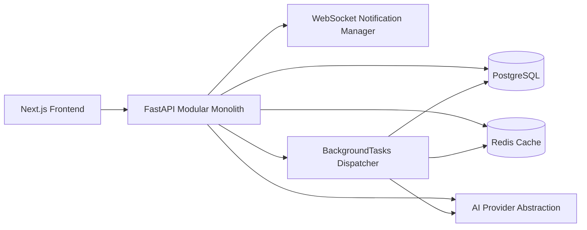

# StreamSphere System Design

## Product Overview

StreamSphere is a streaming discovery platform that combines a movie catalog, user engagement features, admin tooling, and AI-assisted discovery in one modular monolith. The product supports catalog browsing, reviews, ratings, watchlists, favorites, recommendations, notifications, and platform analytics.

## Functional Requirements

- User registration and JWT login
- Movie catalog CRUD with genres, filters, and pagination
- Watchlist, favorites, ratings, reviews, and profile views
- AI search, AI summaries, personalized recommendations, and personalized home feed
- Continue watching and watch-progress tracking
- Real-time notifications over WebSockets with REST fallback
- Admin moderation, admin analytics, and user management
- Health, metrics, caching, rate limiting, and structured logging

## Non-Functional Requirements

- PostgreSQL-backed durability
- Redis-backed caching with in-memory fallback
- Safe degradation when Redis or AI providers are unavailable
- Stateless API instances for horizontal scaling
- Observable request, cache, AI, and WebSocket behavior
- Backward-compatible API evolution where practical
- Incremental migration path using Alembic

## Architecture Diagram

## Frontend Architecture

- Next.js App Router provides route composition and static/dynamic rendering boundaries.
- Server-side catalog reads use fetch-based data access where possible.
- Authenticated interactions live in client components where JWT access tokens are needed.
- NotificationCenter uses WebSockets first and falls back to REST polling.
- `next/image` is used on key poster surfaces to reduce image-related layout and bandwidth costs.

## Backend Architecture

- FastAPI route modules are grouped by domain: auth, movies, engagement, AI, notifications, profile, admin, health, and metrics.
- SQLAlchemy models and services stay inside one codebase with explicit boundaries.
- Business logic is pushed into services such as recommendations, analytics, summaries, notifications, and metrics.
- Background work is abstracted through `BackgroundJobDispatcher`, which currently uses FastAPI `BackgroundTasks`.

## Database Architecture

- PostgreSQL is the system of record.
- Core tables: `users`, `movies`, `genres`, `movie_genres`, `watchlists`, `favorites`, `ratings`, `reviews`, `watch_progress`, `movie_summaries`, `recommendation_cache`, `notifications`, `activity_events`.
- Sprint 9 adds compound indexes for high-frequency paths such as movie sorting, notification unread reads, profile progress, and analytics aggregations.
- Alembic provides schema management while preserving local data through a stamp-first baseline strategy for already-populated databases.

## Caching Strategy

- Redis is the preferred cache backend.
- In-memory fallback keeps the platform usable when Redis is disabled or unavailable.
- Cached flows:
  - AI search responses
  - AI summaries
  - recommendation payloads
- Invalidation triggers:
  - ratings, reviews, favorites, watchlists, and progress updates invalidate the affected user's recommendation cache
  - movie updates and deletes invalidate recommendation caches globally and clear summary cache for the affected movie
- Cache keys are namespaced to prevent cross-user data leakage.

## WebSocket Architecture

- `/ws/notifications` authenticates with the same JWT used for REST requests.
- Connections are tracked by user ID, not by browser session ID alone.
- Multiple tabs or devices for the same user can stay connected simultaneously.
- Disconnects are handled gracefully, and the frontend falls back to REST polling when the socket is unavailable.

## AI Provider Architecture

- `AIProvider` is the provider interface.
- `MockAIProvider` is the default implementation for local development and tests.
- `OpenAIProvider` remains a placeholder boundary for future integration.
- Sprint 9 adds resilience around provider calls:
  - request timeout
  - bounded retry count
  - graceful fallback payloads
  - AI failure metrics

## Background Jobs

- Current background execution uses FastAPI `BackgroundTasks`.
- Jobs include:
  - notification creation
  - recommendation refresh
  - summary regeneration
- This keeps routes thin while preserving a future path to Celery, RQ, or another queue.

## Authentication Flow

1. User registers with email, username, and password.
2. Password is hashed with Argon2 for new accounts.
3. Login returns a JWT bearer token.
4. Protected REST routes use bearer auth.
5. WebSocket notification connections authenticate with the same JWT token.

## Recommendation Flow

1. User ratings, favorites, watchlist entries, and reviews build preference signals.
2. Recommendation service derives top genres and unseen candidates.
3. Results are cached per user.
4. User-affecting mutations invalidate and refresh recommendation inputs.

## Notification Flow

1. Domain event occurs, such as rating save, watchlist add, review interaction, or movie completion.
2. Background dispatcher creates a `notifications` row.
3. Notification service pushes the payload to every active socket for that user.
4. Frontend updates unread count live; REST remains available for refresh and ownership-safe mutation.

## Scalability Path

### 1,000 Users

- Single PostgreSQL instance
- Single Redis instance
- 1-3 API instances behind a basic load balancer
- BackgroundTasks remain acceptable

### 100,000 Users

- Horizontal API scaling behind a load balancer
- Connection pooling and tighter Postgres tuning
- Read replicas for analytics and heavy read paths
- Redis moved to managed HA deployment
- CDN for frontend assets and poster/media delivery
- Background tasks moved to a real queue and worker pool
- WebSocket fan-out externalized through Redis pub/sub or a socket gateway

### 10 Million Users

- Regional API fleets with stateless containers
- Managed Postgres with partitioning, read replicas, and possibly service decomposition for write-heavy domains
- Redis cluster or sharded managed cache
- CDN plus object storage for all media and static assets
- Dedicated analytics pipeline and warehouse
- Dedicated recommendation infrastructure, potentially batch + online features
- Queue-backed notification pipeline and distributed WebSocket delivery layer

## Microservices Decision

The modular monolith is the correct architecture today because:

- product scope is still evolving quickly
- cross-domain changes remain common
- deployment simplicity matters more than organizational separation
- local development and testing are still fast enough

Potential future service boundaries:

- auth
- catalog
- recommendations
- notifications
- analytics
- media processing

Triggers for extraction:

- separate scaling requirements
- independent deploy cadence becomes a bottleneck
- team ownership boundaries become stable
- queue- or compute-heavy workloads dominate one domain

## Failure Mode Analysis

### PostgreSQL unavailable

- Current behavior: `/health` becomes `503`, request handlers fail, clients receive safe error responses.
- Recommended production behavior: fail fast, alert immediately, and keep static frontend surfaces available.

### Redis unavailable

- Current behavior: cache and rate limiting fall back to in-memory implementations where supported; `/health` reports `degraded`.
- Recommended production behavior: alert, monitor increased database load, and restore Redis quickly.

### AI provider unavailable

- Current behavior: search and summary endpoints return graceful fallback payloads instead of crashing the movie platform.
- Recommended production behavior: circuit-break noisy providers and alert on failure rate.

### WebSocket drops

- Current behavior: connection manager cleans up sockets; frontend falls back to REST refresh.
- Recommended production behavior: retry with backoff and track disconnect rates.

### Background task fails

- Current behavior: failure is isolated to the task and logged; user-facing REST request can still succeed.
- Recommended production behavior: move tasks to durable queues with retries and dead-letter handling.

### Frontend cannot reach backend

- Current behavior: client components show fetch errors; server-rendered pages can fail if required backend data is unavailable.
- Recommended production behavior: show explicit degraded states and route-level retry guidance.
