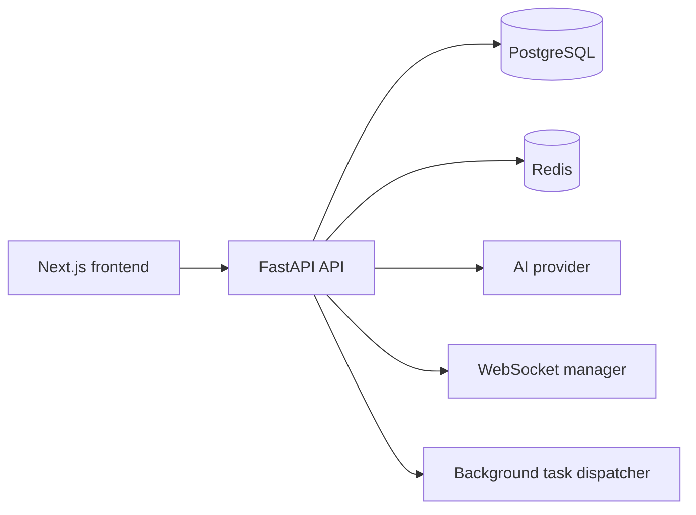

# StreamSphere System Design

## Scope

StreamSphere is a movie discovery application with a catalog, user libraries, reviews, recommendations, notifications, and admin tools. It is a modular monolith: the backend is deployed as one FastAPI application, while domain boundaries remain explicit in route, service, model, and schema modules.

## Runtime Architecture

- Next.js renders catalog pages and hosts client-side authenticated interactions.
- FastAPI owns REST and WebSocket contracts, validation, authorization, and domain services.
- PostgreSQL is the source of truth for catalog, user, engagement, notification, and analytics data.
- Redis supports shared caching and rate limiting when configured. Local in-memory fallbacks keep development and degraded operation usable.
- The AI provider interface keeps mock behavior deterministic for tests and establishes a boundary for a future provider implementation.

## Backend Boundaries

`app/api/` contains HTTP and WebSocket endpoints. `app/services/` owns recommendation, search, summary, notification, cache, analytics, and background-work behavior. `app/models/` and `app/schemas/` separate persistence from request and response contracts.

Routes stay thin: they validate inputs, resolve dependencies, call services, and return schemas. Services own invalidation and cross-domain behavior so mutations such as ratings, reviews, favorites, watchlists, and progress updates can refresh recommendation inputs consistently.

## Data Model

PostgreSQL stores users, movies, genres, movie-to-genre relationships, favorites, watchlists, ratings, reviews, watch progress, summaries, recommendation cache entries, notifications, and activity events. Foreign keys, uniqueness constraints, and targeted indexes support catalog filtering, user-library reads, and admin analytics.

Alembic manages schema changes. Existing local databases use the documented baseline process before applying later revisions.

## Request And Cache Flow

Catalog queries read from PostgreSQL. AI search results, movie summaries, and recommendation payloads can be cached. Cache entries are namespaced and user-scoped where necessary. Engagement mutations invalidate the affected recommendation data; catalog changes invalidate relevant shared results.

When Redis is unavailable, the API uses local fallback implementations and reports degraded dependency health. That fallback is appropriate for a single process or local development, not for coordinating multiple API instances.

## Notifications And Background Work

The notification service persists an event before delivering it to active WebSocket connections. The frontend can fall back to REST polling when a socket is unavailable.

FastAPI `BackgroundTasks` handles non-blocking work such as notification delivery, summary generation, and recommendation refreshes. It keeps request handlers responsive but is not durable across process restarts.

## Security Boundaries

JWT bearer tokens protect authenticated REST routes and notification WebSockets. Route dependencies enforce active-user, ownership, and administrator checks. Configuration controls CORS, rate limiting, security headers, structured logs, and production startup validation.

## Operational Considerations

The application can run behind a load balancer when PostgreSQL and Redis are shared services. Use Redis for consistent cache and rate-limit state across API instances. Monitor `/health`, `/metrics`, request logs, cache behavior, AI failures, and WebSocket connection health.

If background work becomes slow or reliability-sensitive, move it to a durable queue and worker process. If analytics or recommendation workloads dominate normal API traffic, separate those workloads based on measured demand rather than a predefined service split.

## Current Tradeoffs

- A modular monolith reduces deployment and local-development overhead while the product evolves.
- The mock AI provider supports deterministic tests but does not provide model-backed semantic reasoning.
- In-memory cache and rate-limit fallbacks favor availability over cross-instance consistency.
- Background tasks simplify the current deployment but do not provide retries or durable delivery.

## Next Improvements

- Implement the provider boundary with an approved external AI service.
- Add browser end-to-end tests for critical authenticated flows.
- Introduce durable jobs for work that must survive process restarts.
- Tighten the content security policy as frontend requirements allow.
